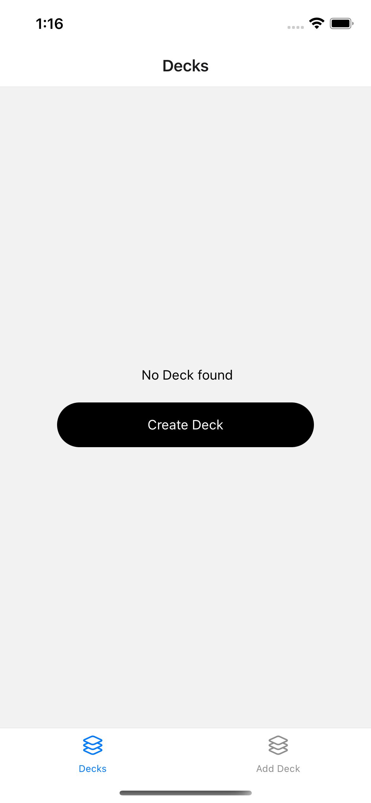
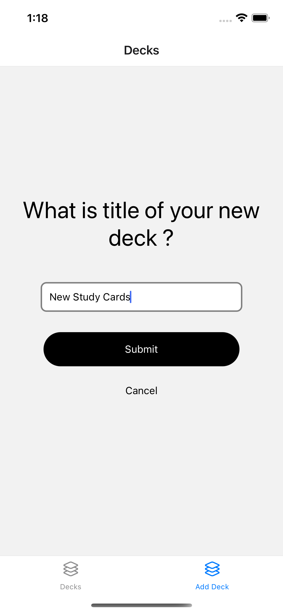
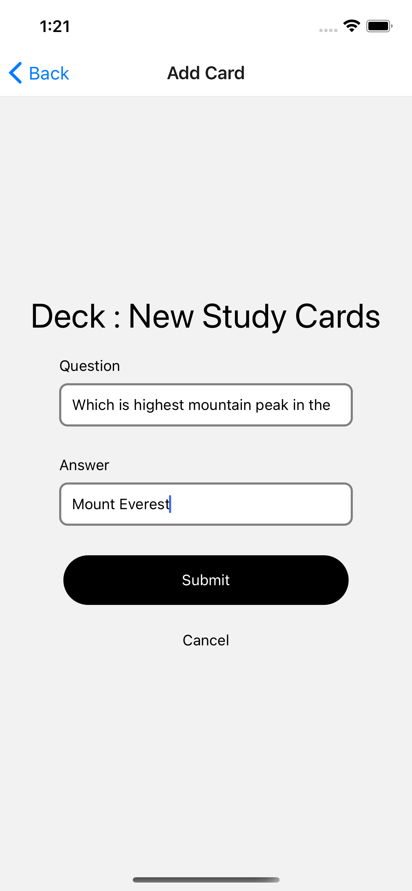
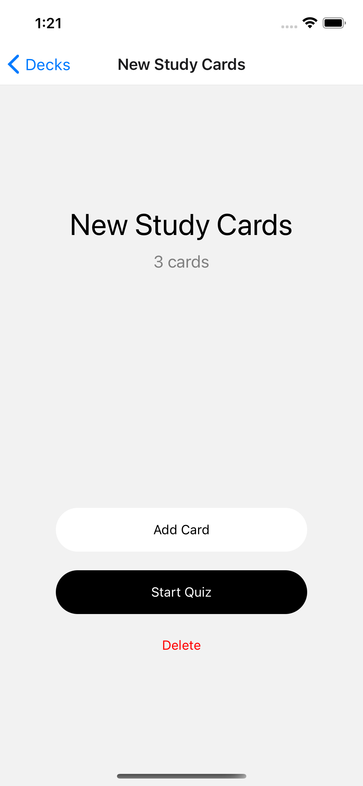
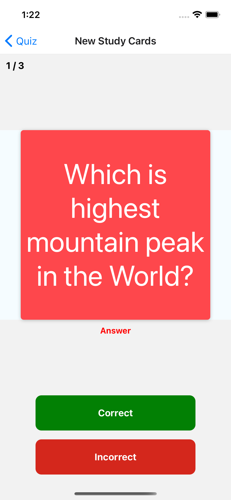
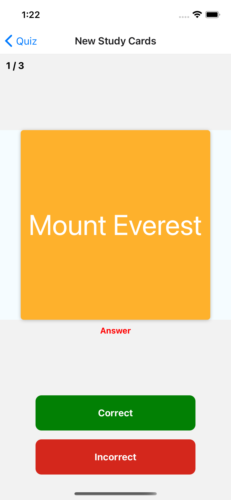
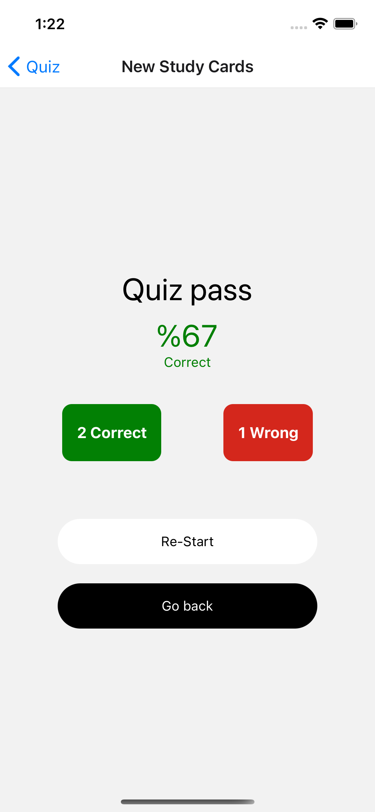
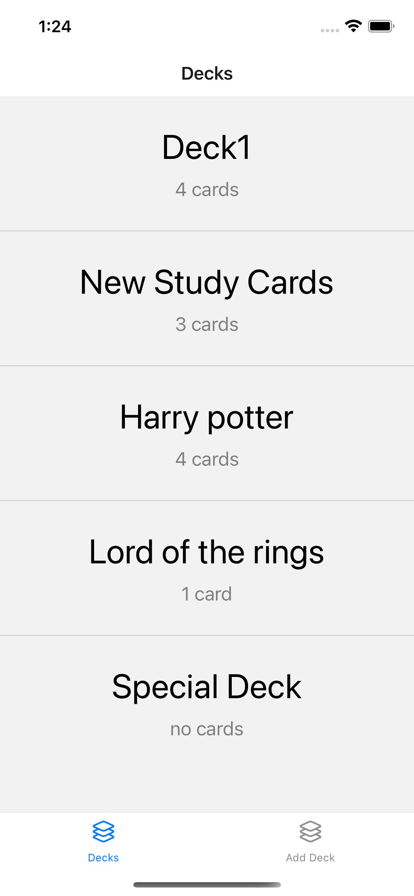

# Mobile Flash Cards,

React Native Flash Cards , questions and answers.

---

- [ x ] Card flips.
- [ x ] Notifications.
- [ x ] AsyncStore.

### ⚽️ Running in the browser

- install Expo project `yarn`
- start iOS project : `yarn ios`
- start project : `yarn android`
## Screen Shots

  
  
  
  

  
  
  
  

#### Tested

    with iOS (iPhone12 & iPhone 6s) & android emulators

## Author

Murat Mayadağ - [GitHub](https://github.com/mmayadag) - [LinkedIn](https://www.linkedin.com/in/murat-mayadag/)

## License

This project is licensed under the MIT License.
